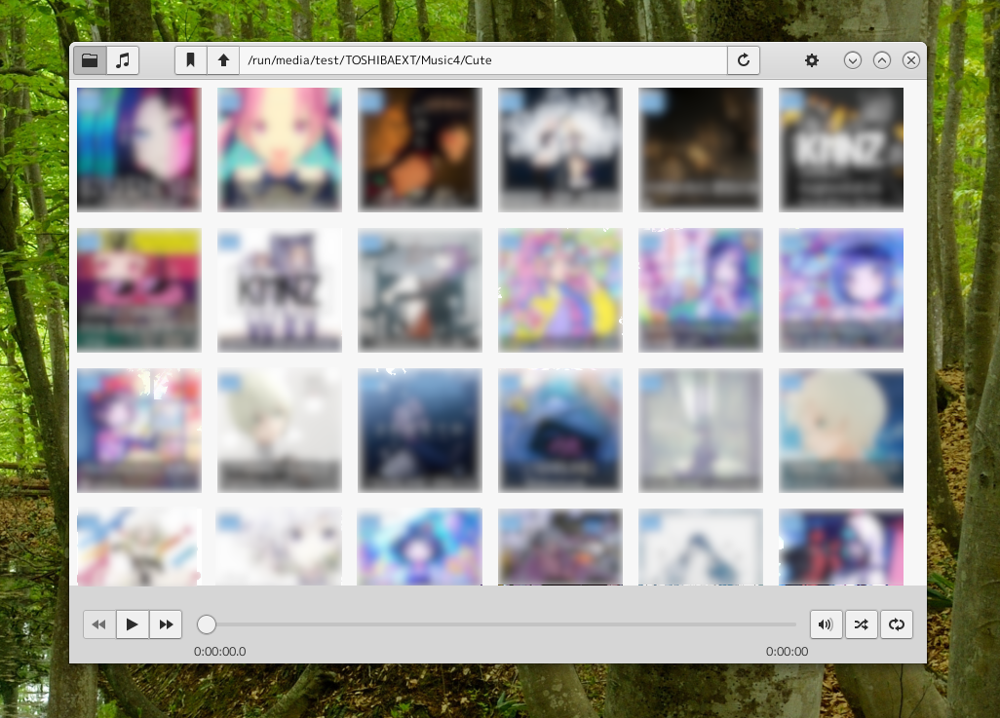
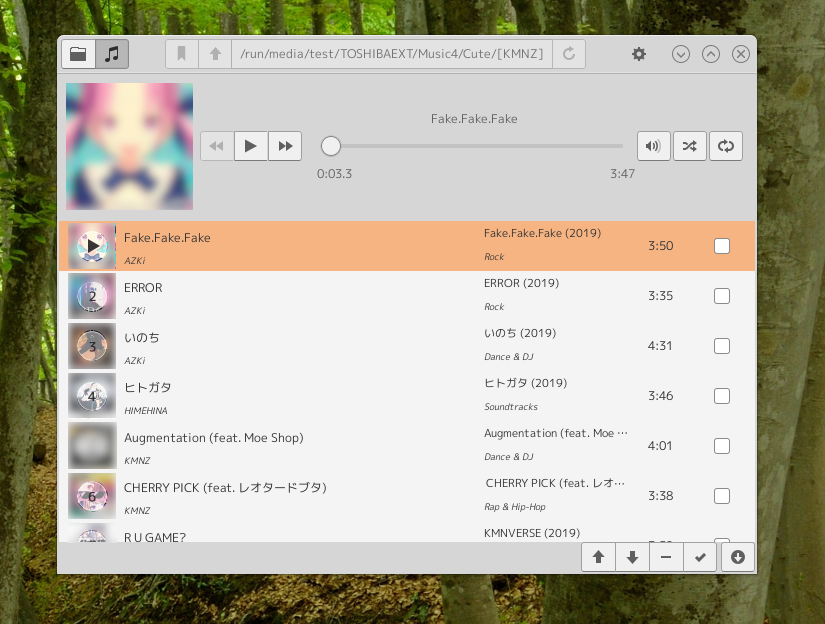

# Tatam

A simple GTK+3 music player written in vala.

## Screenshots





## Features

### Finder view actions:
* Click "Play" button on a music file, then this app adds the music file into the newly created playlist plays it.
* Click "Play" button on a directory, then this app adds the all music files in the directory recursively into the newly created playlist plays them.
* Click "Add" button on a music file, then this app adds the music file into the newly created playlist;
* Click "Add" button on a directory, then this app adds the all music files into the playlist in the directory recursively.
* Click "Bookmark" button on a directory, then this app adds this directory into the bookmark list that can be found on header menu popup.

### Playlist view actions:
* Click the artwork image to enlarge it.
* Click an icon in the playlist to playback / pause it
* Click a row in the playlist to check / uncheck it
* Click "up arrow" button to move up checked items in the playlist
* Click "down arrow" button to move down checked items in the playlist
* Click "minus" button to remove checked items from the playlist
* Click "check" button to "Select all" if there are no checked items or "Unselect All" if there are more than one checked items.
* Click "Save" button to save currently displayed playlist with unique name or overwrite the playlist with the same name.

### Other features
* Shuffling the playlist
* Repeating the playlist
* Seaking the currently playing music.
* Stylesheet is editable in the ~/.tatam directory.
* Playlist is editable that names are with ".m3u" extension in the ~/.tatam directory.

## Requirements

* vala
* gtk+-3.0
* gee-0.8
* gstreamer-1.0
* meson

## Build

```
cd tatam
meson --prefix=/usr/local builddir
cd builddir
meson compile
```

## Install

```
sudo meson install
```

## Other informations
* It uses /tmp/tatam directory. You should chmod your user name on this directory.
* It creates directory "~/.tatam" to put configuration and resource files.
